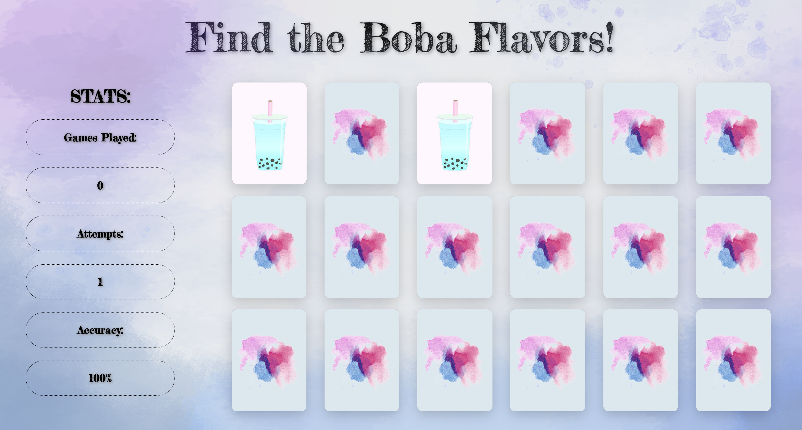

# Bobafy

A JavaScript memory matching application designed to fit a modern, diverse boba-drink aesthetic.

## Technologies Used

- JavaScript
- jQuery
- HTML5
- CSS3
- AWS EC2

## Live Demo

Link: https://bobafy.juliehchung.com

## Features

- Users can click on card images to begin the card matching process
- Users can view their matching accuracy
- Users can view their number of attempts during their current game
- Users can view how many games they have played
- Users can restart the game upon completion

## Preview

